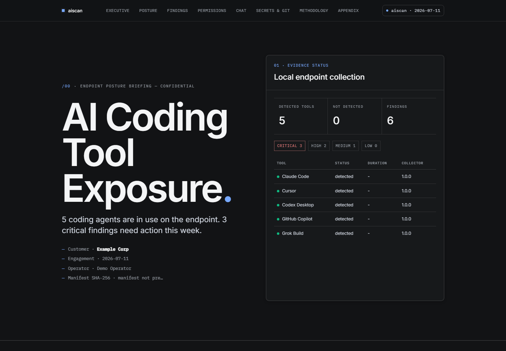

# ai-agent-audit

Offline Windows endpoint scanner for AI coding agent security posture. One
command inventories what Claude Code, Cursor, Codex, GitHub Copilot, and Grok
Build are allowed to do on a machine, what chat history they have stored
locally, and where secrets may have landed. Output is an evidence layer that
never contains raw transcripts or identifying filesystem paths, plus an
executive HTML briefing (dark editorial layout with posture grid and per-tool
MCP summaries).

```powershell
.\aiscan.ps1 all -OutDir C:\scans\today -Briefing
```

That runs every collector and opens a self-contained HTML report. See a
[sample report built from synthetic data](https://robrounsavall.github.io/ai-agent-audit/sample-report.html)
before running anything.

[](https://robrounsavall.github.io/ai-agent-audit/sample-report.html)

## Why

AI coding agents are privileged, semi-autonomous actors on developer
endpoints. They hold allow-lists for shell execution, network egress, and MCP
tooling. They store full chat transcripts (which accumulate secrets) in
predictable local paths. Most security teams have no inventory of any of it.
This tool answers the first question: **what is exposed on this endpoint
today?**

## Trust statement

- **Read-only.** Collectors never modify tool configuration, sessions, or
  credential stores.
- **Offline.** No network calls. Nothing leaves your machine.
- **Credential stores are detected, never opened for values.** `auth.json`
  and equivalents contribute presence and auth-method only.
- **Transcripts stay local.** Raw chat content only ever lands in the local
  `raw/` directory. The `evidence/` layer carries counts, sizes, hashes, and
  redacted samples — the contract is [SCHEMA.md](SCHEMA.md).
- Stdlib-first Python: 9 of 10 collectors run on stock Python 3.10+ with no
  pip install. Small enough to audit before you run it.

## What it collects

| Collector | What it reads | What it reports |
|---|---|---|
| `claude` | `~/.claude` settings + project settings + desktop app MCP config | allow/deny/ask rules, MCP servers, bypass modes, prompt-history/file-snapshot retention |
| `cowork` | `%APPDATA%\Claude` (Claude desktop app) | Cowork session workspaces: transcripts, outputs, Office preview cache, cloud bridging |
| `cursor` | Cursor `state.vscdb` + project data | permission posture, MCP configuration |
| `codex` | `~/.codex` sessions + `config.toml` | approval events, trusted projects, sandbox/telemetry posture |
| `copilot` | VS Code / JetBrains Copilot settings | enable state, exclusions, telemetry |
| `grok` | `~/.grok/config.toml` + session metadata | permission mode (always-approve/yolo), MCP servers |
| `chat-history` | all transcript sources | volume, retention, secret-hit indicators (content stays in local `raw/`) |
| `git-posture` | repos under `~/repos`, `~/code`, `~/src`, `~/projects`, `~/source` | `.env` in history, hooks, ignore posture, large blobs |
| `secrets-scan` | chat corpus + repo roots | gitleaks findings with redacted samples |
| `pii-scan` (optional) | chat corpus | Presidio PII entities; needs venv + ~600MB model |
| `tools/mcp-visibility` | MCP configs across all tools | server inventory, definition drift, auth posture (tokens always masked) |

## Prerequisites

Required:

- Windows 10/11, PowerShell 5.1+
- Python 3.10+ on PATH

Every collector except `pii-scan` runs on that alone — pure stdlib, no pip
install. Two collectors depend on extra tooling and report a finding instead
of results when it is missing:

**`secrets-scan`** shells out to [gitleaks](https://github.com/gitleaks/gitleaks).
Install it and make sure it is on PATH:

```powershell
winget install Gitleaks.Gitleaks
# or: scoop install gitleaks / choco install gitleaks
# or download the release binary and add its folder to PATH
```

**`pii-scan`** needs Microsoft Presidio plus a spaCy model (~600MB). It is the
only collector that needs a venv, and `aiscan.ps1 all` skips it by design:

```powershell
python -m venv .venv
.\.venv\Scripts\Activate.ps1
pip install -r requirements.txt
python -m spacy download en_core_web_lg
.\aiscan.ps1 pii-scan   # run inside the venv
```

macOS/Linux are not supported yet. The evidence schema and collector logic are
portable; path resolution is Windows-first. Contributions welcome.

## Usage

```powershell
# Everything, throwaway output, results printed to console
.\aiscan.ps1

# One collector
.\aiscan.ps1 claude

# Persistent output + HTML briefing
.\aiscan.ps1 all -OutDir C:\scans\2026-07-07 -Briefing

# Mask usernames/paths/secrets for output you intend to share
.\aiscan.ps1 all -Redact

# What would be scanned, reading nothing
.\aiscan.ps1 discover
```

MCP server inventory across all five tools:

```powershell
python tools\mcp-visibility\mcp_visibility.py --format summary
```

## Evidence model

Every collector writes one JSON envelope to `evidence/<name>.json`:
`findings` (severity-ranked), `rules` (normalized allow/deny/ask inventory),
`summary` (numeric / controlled vocabulary only), `raw_pointers` (local-only
file references, never share-safe). Workspace identity is hashed
(`scope_label_redacted`), full filesystem paths never land in evidence, and
transcript text never leaves the local `raw/` directory.
[SCHEMA.md](SCHEMA.md) is the contract; collectors that violate it are bugs.

## Repo layout (components)

One GitHub repository; tools are folders so each can be tested alone:

```
core/                 # shared common.py, paths.py, discover.py
components/
  claude/             # collector + tests + fixtures + README
  cursor/
  codex/
  copilot/
  grok/
  chat-history/
  git-posture/
  secrets-scan/
  pii-scan/
report/               # HTML briefing builder
tools/mcp-visibility/ # cross-tool MCP inventory utility
scripts/test-component.ps1
aiscan.ps1            # orchestrator (one tool or all)
SCHEMA.md             # evidence contract (all collectors)
```

## Development / testing one tool

```powershell
# One component
.\scripts\test-component.ps1 -Name claude
.\scripts\test-component.ps1 -Name codex

# Everything (all components + integration + mcp-visibility)
.\scripts\test-component.ps1 -Name all

# Live scan one tool on this machine
.\aiscan.ps1 claude
```

CI runs a matrix job per component on `windows-latest` so a regression in
one collector fails only that cell.

Synthetic demo evidence (no real machine data) lives in
`samples/synthetic-demo/`; regenerate with `python samples\make-synthetic-demo.py`.

## License

MIT. See [LICENSE](LICENSE) and [THIRD_PARTY_NOTICES.md](THIRD_PARTY_NOTICES.md).
Not affiliated with Anthropic, OpenAI, Cursor, xAI, Microsoft, or GitHub.
