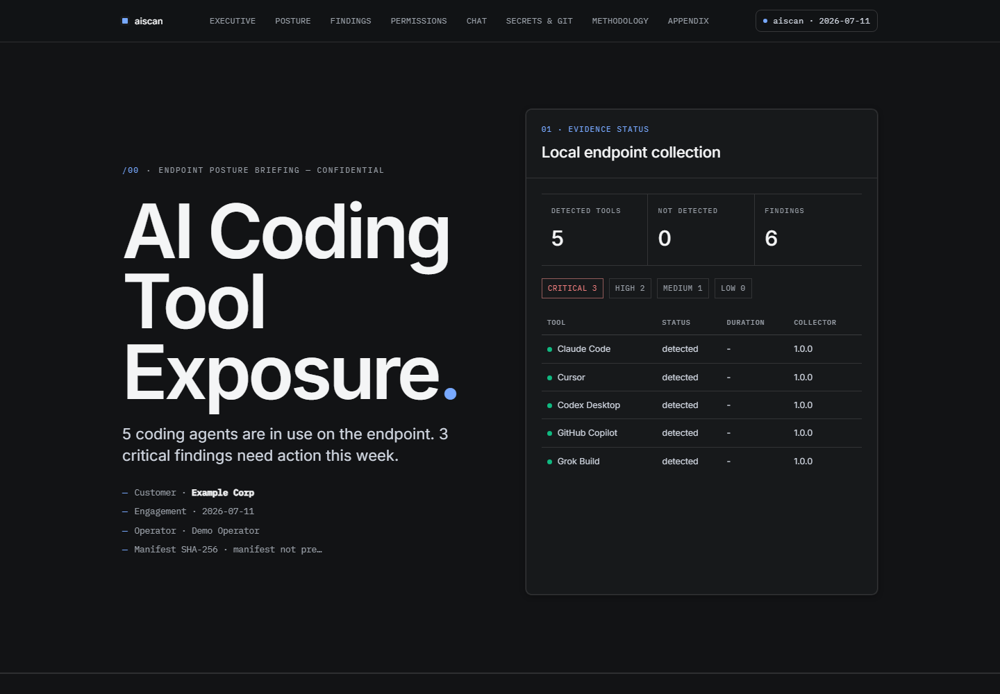

# ai-agent-audit

Offline Windows endpoint scanner for AI coding agent security posture. One
command inventories what Claude Code, Cursor, Codex, GitHub Copilot, Grok
Build, and Grok Bot are allowed to do on a machine, what chat history they have stored
locally, and where secrets may have landed. Output is an evidence layer that
never contains raw transcripts or identifying filesystem paths, plus an
executive HTML briefing. Report v2 opens with a summary, then tabs for
findings, the access map, what changed since the last scan, collector detail,
telemetry approvals, usage, and coverage gaps. See
[docs/report-v2.md](docs/report-v2.md). A draft built from synthetic data is
[samples/report-v2-draft.html](samples/report-v2-draft.html).

```powershell
.\aiscan.ps1 all -OutDir C:\scans\today -Briefing
```

That runs the offline collectors, writes what changed since the previous
scan, and opens a self-contained HTML report. See a
[sample report built from synthetic data](https://robrounsavall.github.io/ai-agent-audit/sample-report.html)
before running anything. The report v2 draft in this repo is
[samples/report-v2-draft.html](samples/report-v2-draft.html).

[](https://robrounsavall.github.io/ai-agent-audit/sample-report.html)

## Why

AI coding agents are privileged, semi-autonomous actors on developer
endpoints. They hold allow-lists for shell execution, network egress, and MCP
tooling. They store full chat transcripts (which accumulate secrets) in
predictable local paths. Most security teams have no inventory of any of it.
This tool answers the first question: **what is exposed on this endpoint
today?**

## Trust statement

- **Read-only.** Collectors never modify tool configuration, sessions, or
  credential stores. `cloud-agents` sends HTTPS GET only; it cannot create
  or delete a cloud agent even though a personal API key is allowed to.
- **Offline by default.** `aiscan all` makes no network calls. Nothing leaves
  your machine. `cloud-agents` is the opt-in exception: it calls
  `https://api.cursor.com` with a key you supply, and it is not part of `all`.
  `telemetry` is also opt-in and not part of `all`. It reads export files you
  already saved. It does not call Splunk.
- **Credential stores are detected, never opened for values.** `auth.json`
  and equivalents contribute presence and auth-method only.
- **Transcripts stay local.** Raw chat content only ever lands in the local
  `raw/` directory. The `evidence/` layer carries counts, sizes, hashes, and
  redacted samples — the contract is [SCHEMA.md](SCHEMA.md).
- Pure stdlib Python: every collector runs on stock Python 3.10+ with no
  pip install. Small enough to audit before you run it.

## What it collects

| Collector | What it reads | What it reports |
|---|---|---|
| `claude` | `~/.claude` settings + project settings + desktop app MCP config | allow/deny/ask rules, MCP servers, bypass modes, prompt-history/file-snapshot retention |
| `cowork` | `%APPDATA%\Claude` (Claude desktop app) | Cowork session workspaces: transcripts, outputs, Office preview cache (if present), cloud bridging, claude.ai webview local-state presence |
| `cursor` | Cursor `state.vscdb` + project data | permission posture, MCP configuration |
| `codex` | `~/.codex` sessions + `config.toml` | approval events, trusted projects, sandbox/telemetry posture |
| `copilot` | VS Code / JetBrains Copilot settings | enable state, exclusions, telemetry |
| `grok` | `~/.grok/config.toml` + session metadata | permission mode (always-approve/yolo), MCP servers |
| `grok-bot` | `%APPDATA%\Grok Bot` presence, sizes, and mtimes | desktop app data, secrets-store and lockfile presence, newest activity. Local execution is reported unknown, not absent |
| `chat-history` | all transcript sources | volume, retention, secret-hit indicators (content stays in local `raw/`) |
| `git-posture` | repos under `~/repos`, `~/code`, `~/src`, `~/projects`, `~/source` | `.env` in history, hooks, ignore posture, large blobs |
| `secrets-scan` | chat corpus + repo roots | gitleaks findings with redacted samples |
| `pii-scan` | chat corpus | regulated-data indicators: cards (Luhn), SSNs, IBANs, emails, phones, public IPs |
| `cloud-agents` (not in `all`) | Cursor Cloud Agents API (`GET https://api.cursor.com` only) | agent status, repos, branches, PR URLs, latest run, token totals. No dollar cost, no conversation text by default |
| `telemetry` (not in `all`) | Local OTLP and Splunk export files | Approval counts and usage. Cursor `cost_cents` is labeled as from the Cursor dashboard usage export. Dollars are never estimated from tokens |
| `tools/mcp-visibility` | MCP configs across all tools | server inventory, definition drift, auth posture (tokens always masked) |

## Prerequisites

Required:

- Windows 10/11, PowerShell 5.1+
- Python 3.10+ on PATH

Every collector runs on that alone — pure stdlib, no pip install. One
collector depends on extra tooling and reports a finding instead of results
when it is missing:

**`secrets-scan`** shells out to [gitleaks](https://github.com/gitleaks/gitleaks).
Install it and make sure it is on PATH:

```powershell
winget install Gitleaks.Gitleaks
# or: scoop install gitleaks / choco install gitleaks
# or download the release binary and add its folder to PATH
```

macOS/Linux are not supported yet. The evidence schema and collector logic are
portable; path resolution is Windows-first. Contributions welcome.

## Usage

```powershell
# Everything, throwaway output, results printed to console
.\aiscan.ps1

# One collector
.\aiscan.ps1 claude

# Persistent output + HTML briefing.
# Writes evidence\changes.json against the previous sibling scan first.
.\aiscan.ps1 all -OutDir C:\scans\2026-10-07 -Briefing

# Same, with an explicit previous scan folder
.\aiscan.ps1 all -OutDir C:\scans\2026-10-07 -Previous C:\scans\2026-10-01 -Briefing

# Mask usernames/paths/secrets for output you intend to share
.\aiscan.ps1 all -Redact

# What would be scanned, reading nothing
.\aiscan.ps1 discover

# Opt-in Cursor cloud agents (network, not part of `all`)
$env:CURSOR_API_KEY = "crsr_..."   # user API key from Cursor Dashboard -> API Keys
.\aiscan.ps1 cloud-agents -OutDir C:\scans\today
```

`cloud-agents` uses a user API key you create on the Cursor Dashboard API Keys
page. It does not read the Cursor IDE session token and it does not call
`cursor.com/api/dashboard`. The key is sent as `Authorization: Bearer` to
`https://api.cursor.com` and is never printed or written to evidence. Personal
keys cannot be limited to read-only; this command still refuses every method
except GET, refuses every host except `api.cursor.com`, and does not call
`GET /v1/repositories` or the enterprise Admin API (so there is no dollar
cost). Without `CURSOR_API_KEY` it exits 0 and prints how to set the variable.

`-IncludeRunResult` stores the latest run's result text. Leave it off unless
you need that text: it can contain source code or secrets. `-Redact` applies
to it the same way it applies to other collectors.

Opt-in telemetry import (local files, not part of `all`):

```powershell
.\aiscan.ps1 telemetry -OutDir C:\scans\today -OtelFile C:\exports\otel.json -SplunkExport C:\exports\cursor-usage.csv
```

Rebuild the report v2 HTML from a scan you already have, without re-running
the offline collectors:

```powershell
.\scripts\build-draft-report.ps1 -EvidenceRoot C:\scans\2026-10-07 -Previous C:\scans\2026-10-01 -Out C:\scans\2026-10-07\briefing\report-v2.html -OtelFile C:\exports\otel.json -SplunkExport C:\exports\cursor-usage.csv
```

MCP server inventory across all five tools:

```powershell
python tools\mcp-visibility\mcp_visibility.py --format summary
```

## Evidence model

Every collector writes one JSON envelope to `evidence/<name>.json`:
`findings` (severity-ranked), `rules` (normalized allow/deny/ask inventory),
`summary` (numeric / controlled vocabulary only), `raw_pointers` (local-only
file references, never share-safe). Workspace identity is hashed
(`scope_label_redacted`), full filesystem paths never land in evidence, and
transcript text never leaves the local `raw/` directory.
[SCHEMA.md](SCHEMA.md) is the contract; collectors that violate it are bugs.

## Repo layout (components)

One GitHub repository; tools are folders so each can be tested alone:

```
core/                 # shared common.py, paths.py, discover.py
components/
  claude/             # collector + tests + fixtures + README
  cursor/
  codex/
  copilot/
  grok/               # Grok Build (~/.grok), not the Grok Bot desktop app
  grok-bot/           # Grok Bot desktop presence (AppData names, contents unread)
  chat-history/
  git-posture/
  secrets-scan/
  pii-scan/
  cloud-agents/       # opt-in Cursor Cloud Agents API inventory (not in `all`)
  telemetry-import/   # opt-in approvals and usage from local exports (not in `all`)
report/               # HTML briefing builder (summary, then tabs)
tools/mcp-visibility/ # cross-tool MCP inventory utility
scripts/test-component.ps1
aiscan.ps1            # orchestrator (one tool or all)
SCHEMA.md             # evidence contract (all collectors)
```

## Development / testing one tool

```powershell
# One component
.\scripts\test-component.ps1 -Name claude
.\scripts\test-component.ps1 -Name codex
.\scripts\test-component.ps1 -Name cloud-agents
.\scripts\test-component.ps1 -Name telemetry-import

# Everything (all components + integration + mcp-visibility)
.\scripts\test-component.ps1 -Name all

# Live scan one tool on this machine
.\aiscan.ps1 claude
```

CI runs a matrix job per component on `windows-latest` so a regression in
one collector fails only that cell.

Synthetic demo evidence (no real machine data) lives in
`samples/synthetic-demo/`; regenerate with `python samples\make-synthetic-demo.py`.

## License

MIT. See [LICENSE](LICENSE) and [THIRD_PARTY_NOTICES.md](THIRD_PARTY_NOTICES.md).
Not affiliated with Anthropic, OpenAI, Cursor, xAI, Microsoft, or GitHub.
